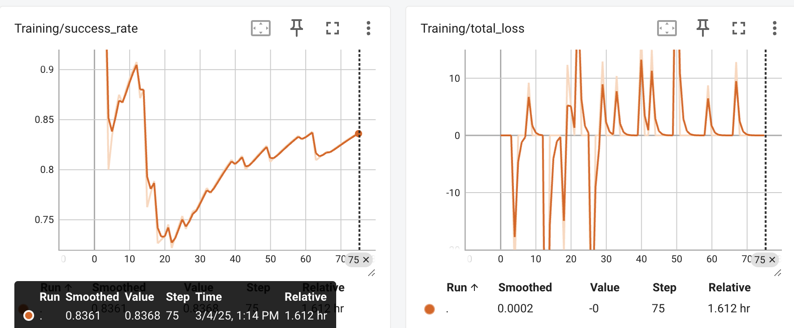
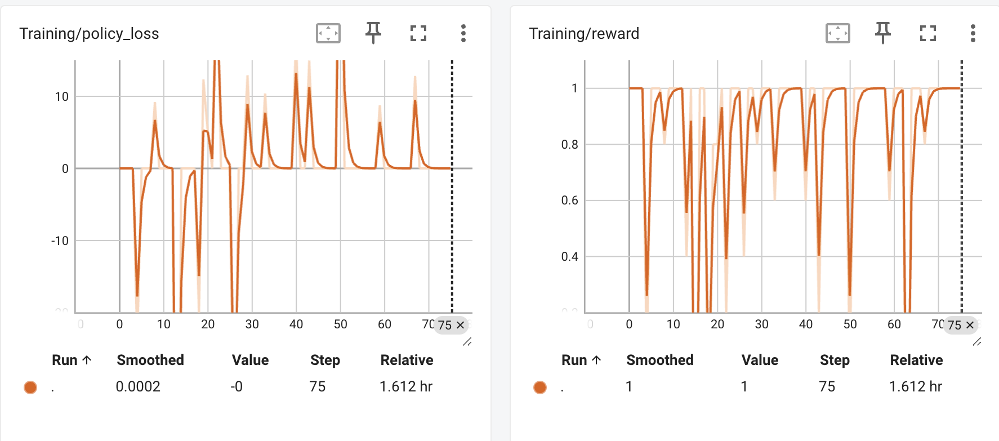

# Q-FLOW


Welcome to **Q-Flow**, we focus on advancing open source development on Reinforcement Learning (RL) for LLMs. At **QFlow**, we treat the 

### What makes QFlow different?

While traditional reinforcement learning focuses on learning optimal actions through trial and error, **QFlow** introduces a unique methodology specifically tailored to the nuances of language models. We provide a toolbox with solutions that bring efficiency, creativity, and adaptability to RL applications for LLMs.


## Installation

To get started with **QFlow**, simply clone the repository and install the dependencies:

```bash
git clone https://github.com/Raj-08/QFlow.git
cd QFlow
pip install -r requirements.txt
```

## Features

- **Dedicated Toolbox**: A set of tools designed to handle reinforcement learning challenges specific to LLMs.
- **Creative Solutions**: Breakthrough techniques and methodologies that make training language models faster, smarter, and more efficient.
- **Scalable Performance**: Optimize LLMs with algorithms like **PPO**, **DPO**, and **GRPO**—designed for the unique needs of the LLM world.
- **Hyperparameter Search**: We use Evolutionary Algorithms to find the right configuration of hyperparametrs to make our trainings more effective.

## Available RL Algorithms

QFlow supports several powerful RL algorithms that can be used to fine-tune your large language models. Choose the one that fits your training requirements:

- [x] **Reinforce-Lite** (Displays Emergence while being computationally affordable)
- [x] **Monte-Carlo**  (Simple RL Monte Carlo , expectation over a sample of returns)
- [x] **Group Relative Policy Optimization (GRPO)** (DeepSeek's RL Algorithm)
- [ ] **Proximal Policy Optimization (PPO)**
- [ ] **Direct Preference Optimization (DPO)**
- [ ] **Actor Critic (A2C)**

## Available Datasets

QFlow has out of the box support for reasoning datasets. We will expand further into process reward datasets. 

- [x] **GSM8K** GradeSchoolMath
- [ ] **Math500**  

QFlow provides a simple command-line interface to train your models using different RL algorithms. Here are some examples:

### Training with Different Algorithms

```bash
# Train using Reinforce-Lite
python main.py --algorithm reinforce-lite \
               --model_name "microsoft/Phi-3.5-mini-instruct" \
               --dataset_name "gsm8k" \
               --batch_size 1 \
               --num_steps 5000 \
               --learning_rate 1e-6

# Train using GRPO
python main.py --algorithm grpo \
               --model_name "microsoft/Phi-3.5-mini-instruct" \
               --dataset_name "gsm8k" \
               --batch_size 1 \
               --group_size 10 \
               --num_steps 5000 \
               --learning_rate 1e-6

# Train using Monte-Carlo
python main.py --algorithm monte-carlo \
               --model_name "microsoft/Phi-3.5-mini-instruct" \
               --dataset_name "gsm8k" \
               --batch_size 1 \
               --num_steps 5000 \
               --learning_rate 1e-6
```

### Common Command Line Arguments

- `--algorithm`: Choose the RL algorithm (`reinforce-lite`, `grpo`, `monte-carlo`)
- `--model_name`: Name or path of the pretrained model to fine-tune
- `--dataset_name`: Name of the dataset to use for training
- `--batch_size`: Number of samples per training batch
- `--num_steps`: Total number of training steps
- `--learning_rate`: Learning rate for optimization
- `--entropy_coef`: Entropy coefficient for exploration (default: 0.001)
- `--group_size`: Group size for GRPO algorithm (default: 10)

### Monitoring Training with TensorBoard

QFlow automatically logs training metrics to TensorBoard. To view the training progress:



1. Start TensorBoard server:
```bash
tensorboard --logdir runs/
```

2. Open your browser and navigate to:
```
http://localhost:6006
```

The TensorBoard interface shows:
- Training loss curves
- Policy and entropy loss
- Average rewards and success rates
- Response lengths
- Sample model outputs
- Training hyperparameters

You can compare different runs by selecting them in the TensorBoard interface. Each run is tagged with the algorithm name and timestamp for easy identification.

### Checkpoints and Model Saving

Models are automatically saved during training:
- Regular checkpoints every 100 steps
- Final model after training completion
- Training state and hyperparameters

Checkpoints are saved in:
```
checkpoints/{algorithm_name}_{timestamp}/
```

To load a saved model for inference or continued training, use the checkpoint path as the `model_name` argument.


